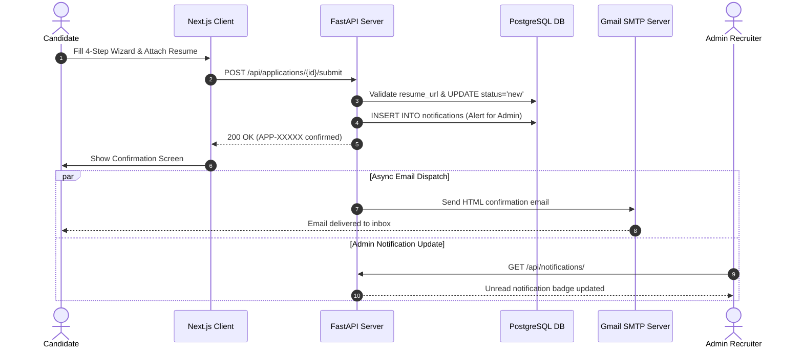

# TalentBridge — Architecture Decision Records (ADRs)

This document outlines key technical decisions, architectural patterns, and design trade-offs made during the development of the **TalentBridge** system.

---

## 1. Architectural Drivers

The design of TalentBridge is guided by the following principles:
- **Separation of Concerns:** Clear boundaries between presentation (Next.js), business logic & API services (FastAPI), and persistent storage (PostgreSQL).
- **Security & RBAC:** Strict segregation between public candidates and privileged administrative recruiters.
- **Candidate User Experience:** Smooth, low-friction application process with multi-step validation, draft auto-saving, and real-time email feedback.
- **Maintainability & Extensibility:** Clean domain models, type-safe schemas (Pydantic + TypeScript), and modular routing.

---

## 2. Architecture Decision Records

### ADR 01: Decoupled Frontend (Next.js 16) and Backend (FastAPI)

* **Context:** The system requires both high-performance public rendering for career postings and dynamic interactive dashboards for recruiters and candidates.
* **Decision:** Separate the client into **Next.js 16 (App Router)** and the API layer into **FastAPI (Python)**.
* **Rationale:**
  - Next.js enables fast client-side navigation, responsive Tailwind CSS layouts, and modular routing.
  - FastAPI provides high-throughput asynchronous execution, native Pydantic data validation, and automatic OpenAPI documentation.
  - Decoupled architecture allows independent scaling and frontend deployment flexibility.

---

### ADR 02: PostgreSQL as Primary Relational Database

* **Context:** The system requires strict referential integrity between users, job requisitions, candidate applications, and notifications.
* **Decision:** Use **PostgreSQL 16** via SQLAlchemy ORM instead of SQLite or NoSQL.
* **Rationale:**
  - SQLite lacks concurrent write scalability and strong constraint enforcement in production environments.
  - NoSQL (MongoDB) lacks native foreign key cascade constraints and relational integrity needed for hiring workflows.
  - PostgreSQL delivers transactional ACID guarantees, native enum types (`ApplicationStatus`, `JobStatus`), and scalable indexing.

---

### ADR 03: Role-Based Access Control (RBAC) & Built-in Administrator Account

* **Context:** Candidates must register freely, but administrative accounts must not be self-registered by arbitrary public users.
* **Decision:**
  - Enforce role enumeration: `role = 'admin'` or `role = 'candidate'`.
  - Public registration API hardcodes `role="candidate"`.
  - Administrative accounts are created exclusively through database seeding or authorized admin provision.
  - Route handlers verify roles via FastAPI dependencies (`get_current_active_admin`, `get_current_active_user`).
  - Admins are restricted from applying to job requisitions directly.

---

### ADR 04: Progressive Draft Persistence in Application Wizard

* **Context:** Candidate applications span 4 distinct steps (Bio, Education, Experience, Resume). Users may lose connectivity or navigate away during submission.
* **Decision:**
  - Step 1 creates an initial database draft record (`status = 'draft'`).
  - Advancing through Steps 2 and 3 triggers background draft patches (`PATCH /api/applications/draft/{id}`).
  - Step 4 executes final verification and updates `status = 'new'` with `submitted_at = NOW()`.
* **Rationale:** Minimizes data loss and allows candidates to resume incomplete applications seamlessly.

---

### ADR 05: Asynchronous SMTP Dispatch for Candidate Confirmations

* **Context:** Application submission should not be blocked or slowed down by external SMTP network latency.
* **Decision:** Use Python's `asyncio.to_thread` to dispatch emails in a non-blocking background thread worker via Gmail SMTP.
* **Rationale:** The candidate receives instant HTTP `200 OK` submission confirmation on screen, while SMTP handshake and message transmission complete asynchronously in the background.

---

### ADR 06: Hybrid Resume Storage Strategy

* **Context:** Candidates upload documents in various formats (PDF, DOC, DOCX), or provide cloud links (Google Drive).
* **Decision:**
  - File uploads are validated, stored in `/uploads`, and served statically via FastAPI's `StaticFiles`.
  - The database records the canonical `resume_url` string.
  - Fallback mechanisms handle both direct uploaded static assets and external cloud drive links seamlessly.

---

## 3. High-Level Component Interaction Diagram

