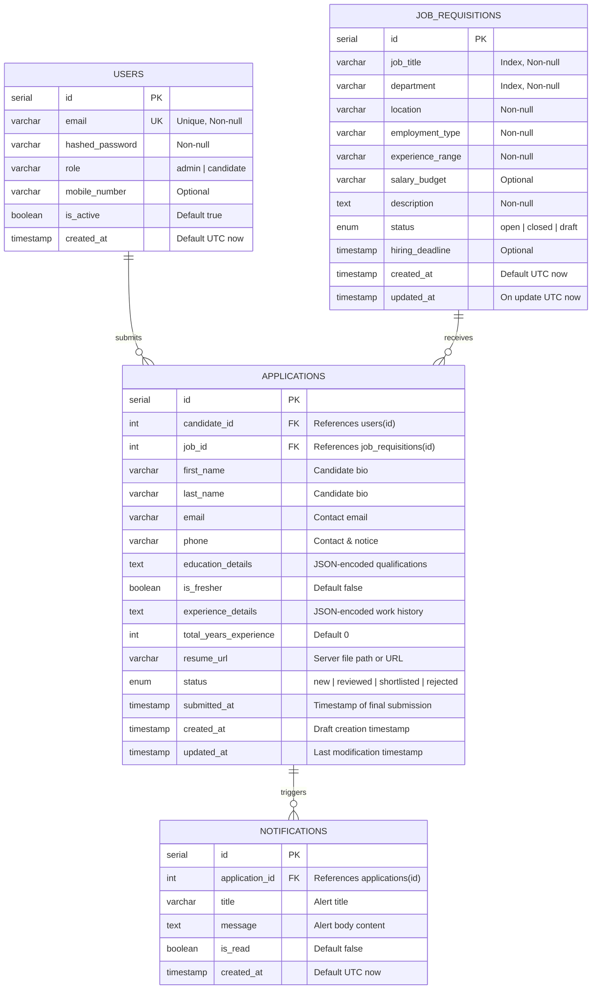

# TalentBridge — Database Schema & Data Models

This document provides complete documentation for the **PostgreSQL** relational database powering the **TalentBridge** system.

---

## 1. Database Overview

- **Database Engine:** PostgreSQL 16
- **Database Name:** `talentbridge`
- **ORM / Schema Management:** SQLAlchemy 2.0 (`Base.metadata.create_all`)
- **Connection URI Format:**
  ```text
  postgresql://postgres:<PASSWORD>@localhost:5432/talentbridge
  ```

---

## 2. Entity-Relationship (ER) Diagram



---

## 3. Detailed Table Specifications

### 3.1 `users` Table
Stores authentication credentials and roles for both candidates and administrators.

| Column | Data Type | Nullable | Default | Description |
|---|---|---|---|---|
| `id` | `INTEGER` | No | Auto-increment | Primary Key |
| `email` | `VARCHAR` | No | None | Unique user email (login identifier) |
| `hashed_password` | `VARCHAR` | No | None | Bcrypt-hashed password |
| `role` | `VARCHAR` | No | `'candidate'` | User role: `'admin'` or `'candidate'` |
| `mobile_number` | `VARCHAR` | Yes | `NULL` | Candidate/Admin phone number |
| `is_active` | `BOOLEAN` | No | `TRUE` | Account active flag |
| `created_at` | `TIMESTAMP` | No | `UTC_NOW` | Account creation timestamp |

---

### 3.2 `job_requisitions` Table
Stores published and drafted job openings posted by administrators.

| Column | Data Type | Nullable | Default | Description |
|---|---|---|---|---|
| `id` | `INTEGER` | No | Auto-increment | Primary Key |
| `job_title` | `VARCHAR` | No | None | Job title (Indexed) |
| `department` | `VARCHAR` | No | None | Department name (Indexed) |
| `location` | `VARCHAR` | No | None | Work location (e.g. Hyderabad / Remote) |
| `employment_type` | `VARCHAR` | No | None | Full-time / Part-time / Contract |
| `experience_range` | `VARCHAR` | No | None | Experience requirement (e.g. 3-5 years) |
| `salary_budget` | `VARCHAR` | Yes | `NULL` | Compensation range |
| `description` | `TEXT` | No | None | Full markdown/text job description |
| `status` | `ENUM` | No | `'open'` | Status: `'open'`, `'closed'`, `'draft'` |
| `hiring_deadline` | `TIMESTAMP` | Yes | `NULL` | Application deadline |
| `created_at` | `TIMESTAMP` | No | `UTC_NOW` | Creation timestamp |
| `updated_at` | `TIMESTAMP` | No | `UTC_NOW` | Last updated timestamp |

---

### 3.3 `applications` Table
Stores candidate applications, bio data, educational qualifications, employment history, and resume attachments.

| Column | Data Type | Nullable | Default | Description |
|---|---|---|---|---|
| `id` | `INTEGER` | No | Auto-increment | Primary Key (Application ID) |
| `candidate_id` | `INTEGER` | No | None | Foreign Key -> `users.id` |
| `job_id` | `INTEGER` | No | None | Foreign Key -> `job_requisitions.id` |
| `first_name` | `VARCHAR` | Yes | `NULL` | Candidate First Name |
| `last_name` | `VARCHAR` | Yes | `NULL` | Candidate Last Name |
| `email` | `VARCHAR` | Yes | `NULL` | Candidate Email |
| `phone` | `VARCHAR` | Yes | `NULL` | Contact info, location, notice period |
| `education_details` | `TEXT` | Yes | `NULL` | JSON string of educational qualifications |
| `is_fresher` | `BOOLEAN` | No | `FALSE` | Fresher toggle indicator |
| `experience_details` | `TEXT` | Yes | `NULL` | JSON string of employment history |
| `total_years_experience` | `INTEGER` | No | `0` | Calculated total years of experience |
| `resume_url` | `VARCHAR` | Yes | `NULL` | Static server URL or cloud link to resume |
| `status` | `ENUM` | No | `'new'` | Pipeline status: `'new'`, `'reviewed'`, `'shortlisted'`, `'rejected'` |
| `submitted_at` | `TIMESTAMP` | Yes | `NULL` | Timestamp when final submission occurred |
| `created_at` | `TIMESTAMP` | No | `UTC_NOW` | Draft creation timestamp |
| `updated_at` | `TIMESTAMP` | No | `UTC_NOW` | Last modified timestamp |

---

### 3.4 `notifications` Table
Stores real-time in-app alerts triggered by candidate application submissions.

| Column | Data Type | Nullable | Default | Description |
|---|---|---|---|---|
| `id` | `INTEGER` | No | Auto-increment | Primary Key |
| `application_id` | `INTEGER` | Yes | `NULL` | Foreign Key -> `applications.id` |
| `title` | `VARCHAR` | No | None | Notification title |
| `message` | `TEXT` | No | None | Notification detailed body message |
| `is_read` | `BOOLEAN` | No | `FALSE` | Read / Unread status flag |
| `created_at` | `TIMESTAMP` | No | `UTC_NOW` | Timestamp when alert was triggered |

---

## 4. Enum Definitions

### `ApplicationStatus`
```sql
CREATE TYPE applicationstatus AS ENUM (
    'new',
    'reviewed',
    'shortlisted',
    'rejected'
);
```

### `JobStatus`
```sql
CREATE TYPE jobstatus AS ENUM (
    'open',
    'closed',
    'draft'
);
```

---

## 5. Useful Inspection Queries in pgAdmin

```sql
-- 1. View all candidate applications with job titles and candidate emails
SELECT 
    a.id AS application_id,
    a.first_name || ' ' || a.last_name AS candidate_name,
    u.email AS candidate_account,
    j.job_title,
    j.department,
    a.status,
    a.resume_url,
    a.submitted_at
FROM applications a
JOIN users u ON a.candidate_id = u.id
JOIN job_requisitions j ON a.job_id = j.id
ORDER BY a.id DESC;

-- 2. Count applications by hiring status
SELECT status, COUNT(*) AS total_count
FROM applications
GROUP BY status;

-- 3. Check unread recruiter notifications
SELECT id, title, message, is_read, created_at
FROM notifications
WHERE is_read = FALSE
ORDER BY created_at DESC;
```
