# TalentBridge — End-to-End Website Walkthrough

This document provides a visual walkthrough of the entire **TalentBridge** platform workflow, covering both the **Recruiter / Admin Flow** and the **Candidate Application Flow**, complete with UI screenshots from the system.

---

## Table of Contents
1. [Admin Authentication](#1-admin-signin)
2. [Admin Dashboard Overview](#2-admin-dashboard-overview)
3. [Job Requisition Creation & Management](#3-create--publish-job-requisition)
4. [Public Careers Portal & Job Listing](#4-public-careers-portal)
5. [Job Details & Multi-Channel Sharing](#5-job-details--social-sharing)
6. [Candidate Authentication (Login / Register)](#6-candidate-signin--registration)
7. [4-Step Application Wizard](#7-4-step-application-wizard)
   - [Step 1: Personal Bio-Data](#step-1-personal-bio-data)
   - [Step 2: Educational Qualifications](#step-2-educational-qualifications)
   - [Step 3: Work Experience](#step-3-work-experience)
   - [Step 4: Mandatory Resume & Final Review](#step-4-mandatory-resume-upload--review)
8. [Application Submission & Confirmation](#8-application-submission--confirmation)
9. [Automated SMTP Email Confirmation](#9-automated-smtp-email-confirmation)
10. [Admin Real-Time Inbound Notification](#10-admin-inbound-notification)
11. [Candidate Application Review & Status Triage](#11-application-review--status-triage)
12. [Candidate Dashboard: My Applications](#12-candidate-dashboard-my-applications)
13. [Admin Settings & System Console](#13-admin-settings--system-console)

---

## 1. Admin Signin
Administrators access the secure console via the dedicated Admin signin portal. Built-in administrative credentials provide full privileges to manage jobs, view candidate data, and triage submissions.

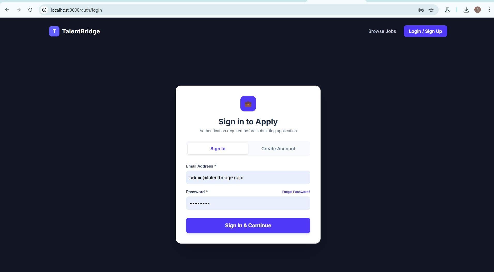

---

## 2. Admin Dashboard Overview
Upon successful login, the Admin Dashboard provides executive metrics: total requisitions, active candidates, applications under review, and recent inbound activities.

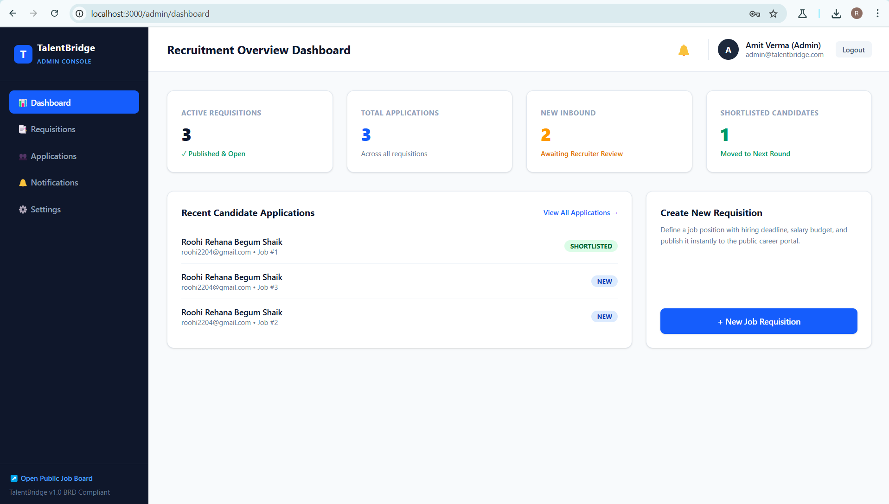

---

## 3. Create & Publish Job Requisition
Recruiters create new job postings specifying Job Title, Department, Location, Employment Type, Experience Range, Salary Range, and detailed Job Descriptions. Postings can be saved as drafts or published immediately.

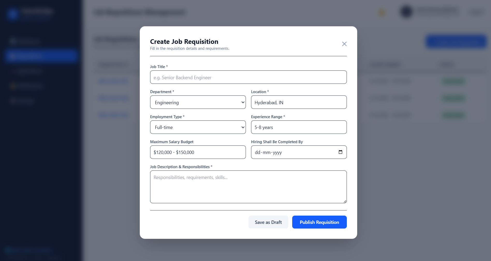

### Published Requisition Management
Admins monitor and manage all open, draft, and closed requisitions in the Requisition Manager table with direct publish/unpublish toggles.

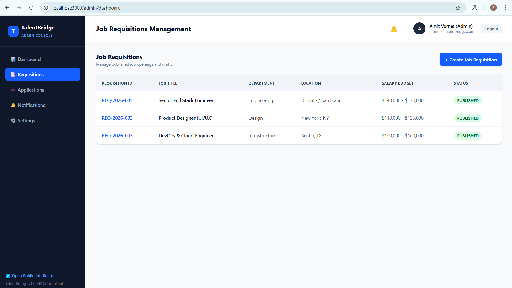

---

## 4. Public Careers Portal
Prospective candidates browse open job requisitions on the modern, responsive careers portal without requiring prior login. Candidates can search and filter by department or location.

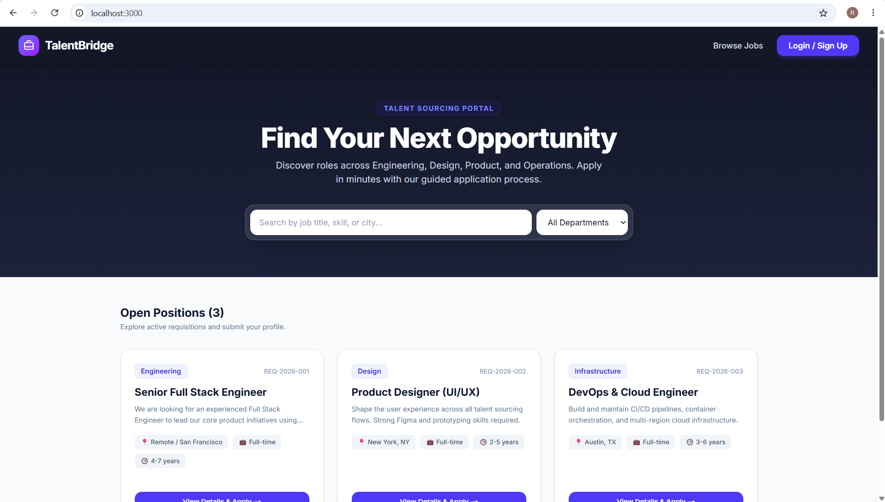

---

## 5. Job Details & Social Sharing
Selecting a job requisition opens the detailed Job Overview page. Candidates can inspect job requirements, department metadata, and experience criteria.

Candidates and recruiters can also click **Share Position** to open the social sharing modal (WhatsApp, LinkedIn, X/Twitter, Email, and 1-Click Direct Link Copy).

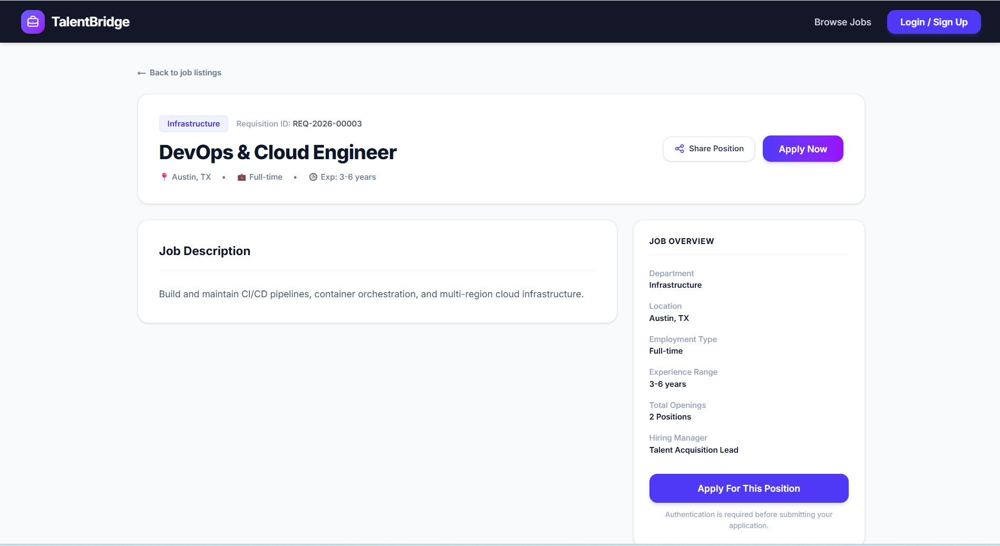

---

## 6. Candidate Signin / Registration
To submit an application, candidates authenticate through the candidate portal or create a new account in seconds.

### Candidate Registration
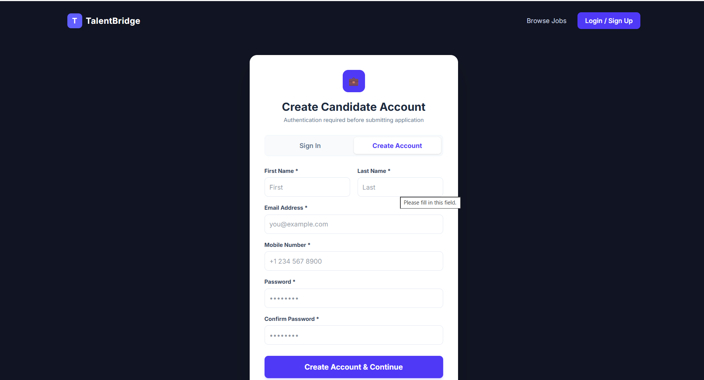

### Candidate Login
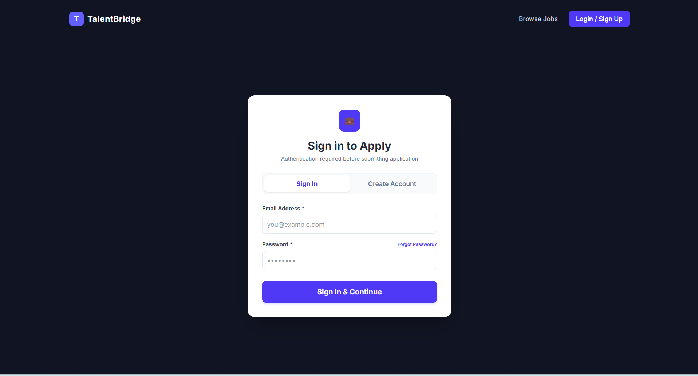

---

## 7. 4-Step Application Wizard

Once authenticated, the candidate is guided through a 4-step wizard with real-time field validation, draft auto-saving, and mandatory `*` field enforcement.

### Step 1: Personal Bio-Data
Collects First Name `*`, Last Name `*`, Gender `*`, Date of Birth `*` (with age validation requiring candidates to be 18+ years old), Current Location `*`, Notice Period `*`, and Address `*`.

.png)

### Step 2: Educational Qualifications
Dynamic education form enabling candidates to add multiple qualifications (Level `*`, Degree/Major `*`, Institution `*`, Passing Year `*`, and CGPA/Grade).

.png)

### Step 3: Work Experience
Allows candidates to list past employment history (Company `*`, Designation `*`, Start Date `*`, End Date, and Key Responsibilities) or activate the 1-click **Fresher** toggle for candidates with no prior formal experience.

.png)

### Step 4: Mandatory Resume Upload & Review
Requires an uploaded resume (PDF, DOC, DOCX) or online resume URL, displays a comprehensive **Application Review Summary** box of all entered data, and requires consent declarations.

.png)

---

## 8. Application Submission & Confirmation
Upon successful submission, the candidate receives an instant confirmation screen displaying their unique Application ID (`#APP-XXXXX`), role details, and next steps.

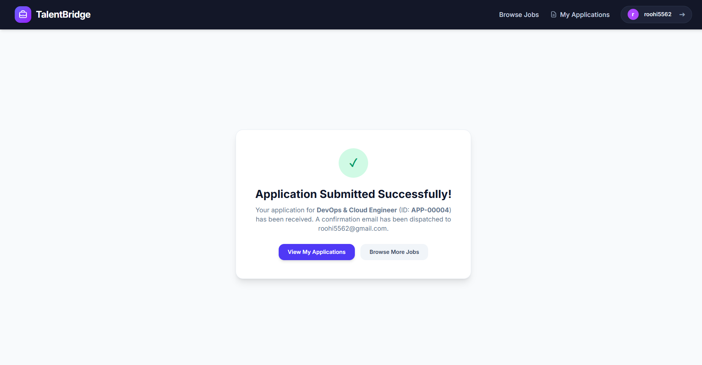

---

## 9. Automated SMTP Email Confirmation
The FastAPI asynchronous email service immediately dispatches an automated HTML confirmation email directly to the candidate's inbox via Gmail SMTP (`talentbridge.careers1@gmail.com`).

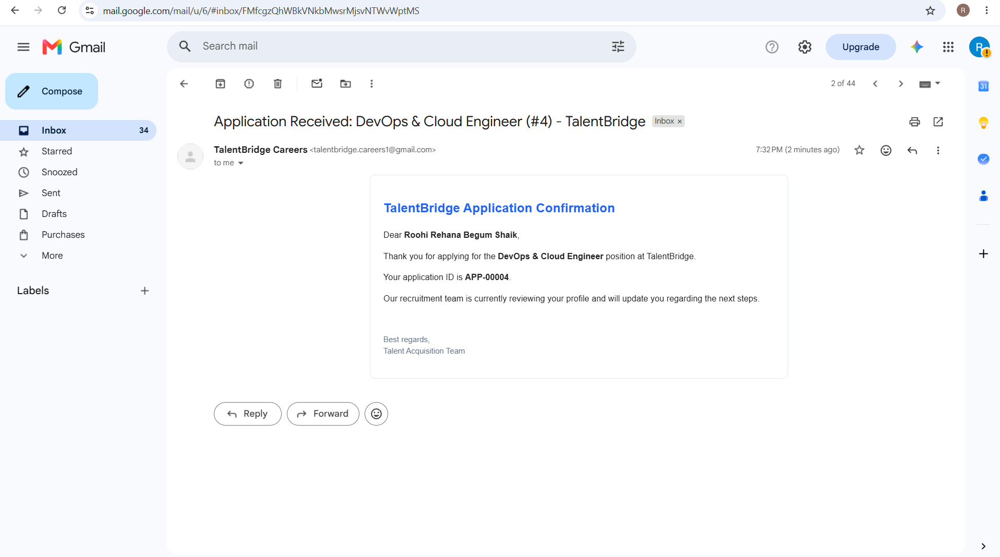

---

## 10. Admin Inbound Notification
In parallel with email dispatch, an in-app notification is registered in the Admin Console. Recruiters see the unread alert badge update in real-time.

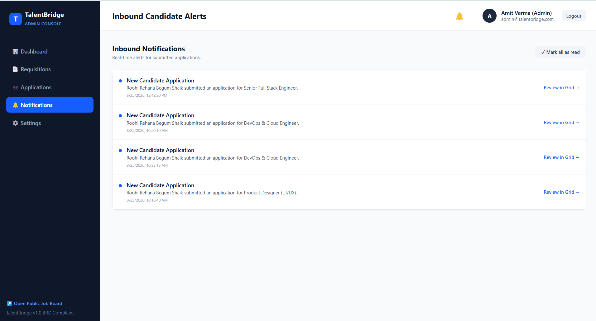

---

## 11. Application Review & Status Triage
Recruiters review all candidate applications in the centralized Candidate Triage Grid. The grid supports search by candidate name/email, filtering by requisition or status, 1-click CSV export, resume previewing, and status updates (`Submitted (New)`, `Under Review`, `Shortlisted`, `Not Selected`).

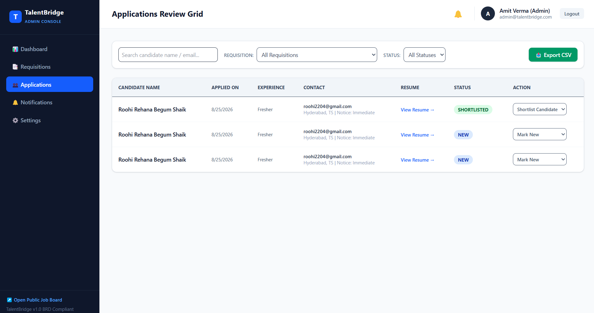

---

## 12. Candidate Dashboard: My Applications
Candidates can track their active submissions in real-time under **My Applications**, viewing the Role Name, Requisition ID, Submission Date, Live Status Badge, and their submitted resume.

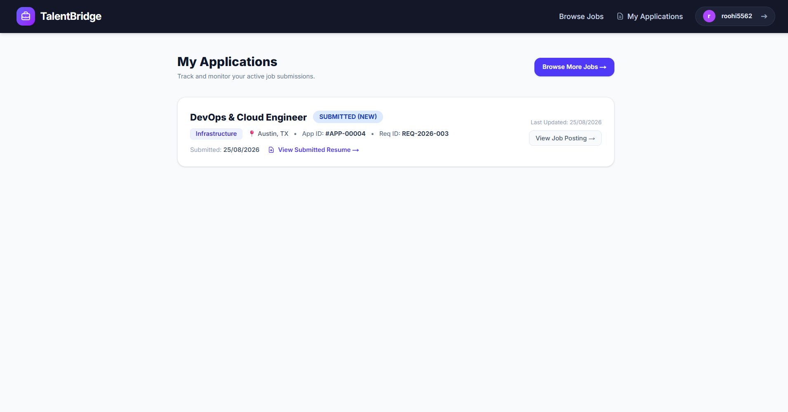

---

## 13. Admin Settings & System Console
The Admin Settings page allows administrators to update their profile, change passwords, configure email and in-app notification preferences, and verify PostgreSQL database and SMTP system connectivity.

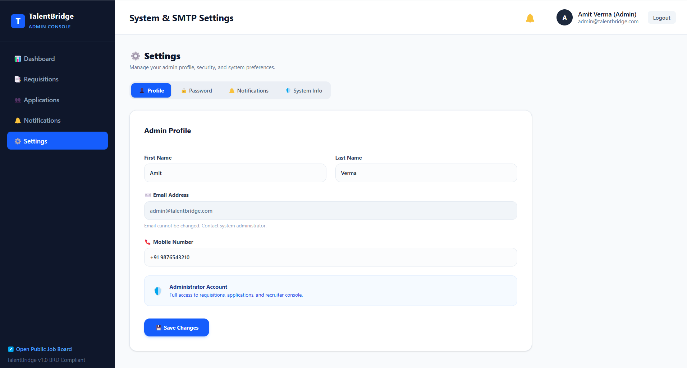
